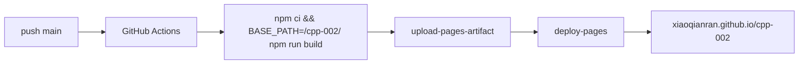
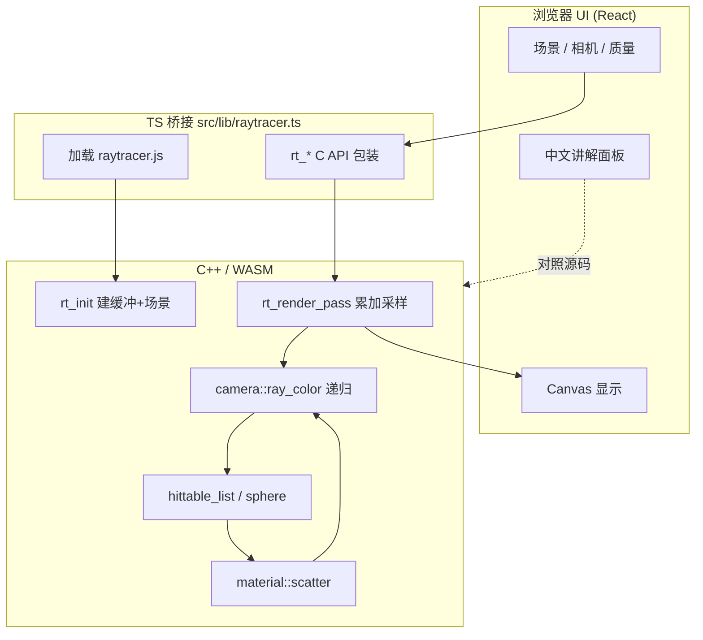
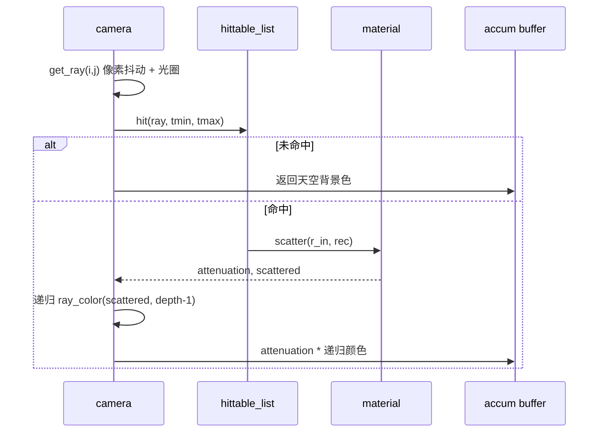
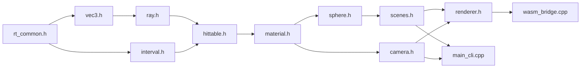

# cpp-002 · C++ 光线追踪学习器

用 **C++** 实现路径追踪（Path Tracing），经 **Emscripten** 编译为 **WASM**，在浏览器里**渐进渲染**；配套中文讲解与 Mermaid 架构图。

> 仓库：[`xiaoqianran/cpp-002`](https://github.com/xiaoqianran/cpp-002)  
> 在线演示（GitHub Pages）：[https://xiaoqianran.github.io/cpp-002/](https://xiaoqianran.github.io/cpp-002/)  
> 灵感：Peter Shirley《Ray Tracing in One Weekend》系列（教学结构）

---

## 你能看到什么

- 三种材质：漫反射（Lambertian）、金属（Metal）、玻璃（Dielectric）
- 三种预设场景、可拖拽环绕相机、FOV / 景深 / 反弹深度
- 蒙特卡洛渐进采样：画面从噪点逐渐干净
- 本地 CLI：输出 PPM 图片

---

## GitHub Pages 部署

推送到 `main` 会触发 [`.github/workflows/deploy-pages.yml`](./.github/workflows/deploy-pages.yml)：



- **Pages 源**：GitHub Actions（不是 branch `/docs`）
- **构建 base**：`/cpp-002/`（适配项目站路径）
- 也可在 Actions 页手动 **Run workflow**

---

## 系统架构



---

## 单像素着色流水线



---

## 模块依赖（C++）



---

## 目录结构

```text
cpp-002/
├── .github/workflows/deploy-pages.yml
├── cpp/                  # C++ 核心（学习主战场）
├── public/
│   ├── raytracer.js
│   └── raytracer.wasm
├── src/                  # React 控制台 UI
├── docs/ARCHITECTURE.md
└── README.md
```

---

## 本地运行

### 环境

- Node 22+
- （可选）[Emscripten](https://emscripten.org/)：重新编译 WASM
- （可选）g++：编译 CLI

### Web 预览

```bash
npm install
npm run dev
```

### 模拟 Pages 路径构建

```bash
BASE_PATH=/cpp-002/ npm run build
npx vite preview --host 0.0.0.0 --port 8080
# 访问 /cpp-002/
```

### CLI 渲染 PPM

```bash
make -C cpp cli
./bin/raytracer_cli 400 225 30 0 > out.ppm
```

参数：`宽 高 每像素样本数 场景ID(0/1/2)`

---

## 关键公式速记

| 概念 | 公式 / 说明 |
| --- | --- |
| 射线 | \(P(t)=O+tD\) |
| 球求交 | 二次方程，取最近正根 |
| 镜面反射 | \(R=V-2(V\cdot N)N\) |
| 漫反射 | 方向 ≈ \(N + \text{random\_unit}\) |
| 折射 | Snell 定律 + Schlick 反射概率 |
| Gamma | 显示前做 \(\sqrt{\cdot}\)（近似 γ=2） |

---

## 学习路径建议

1. 读 `ray.h` + `vec3.h`：建立「射线就是点+方向」
2. 读 `sphere.h`：看判别式如何得到 \(t\)
3. 读 `material.h`：三种 `scatter` 的差异
4. 读 `camera.h` 的 `ray_color`：递归 = 光能沿路径折回
5. 读 `renderer.h`：为什么要累加多样本
6. 读 `wasm_bridge.cpp`：C++ 如何被浏览器调用

更细的图见 [docs/ARCHITECTURE.md](./docs/ARCHITECTURE.md)。

---

## 许可证

学习用途；材质与算法结构参考公开教材思路，实现为原创教学代码。
