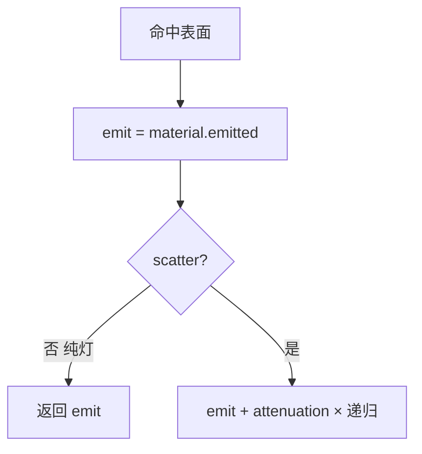
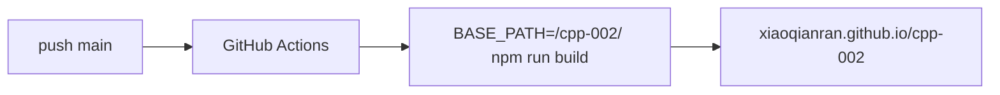

# cpp-002 · C++ 光线追踪学习器

用 **C++** 实现路径追踪（Path Tracing），经 **Emscripten** 编译为 **WASM**，在浏览器里**渐进渲染**；配套中文讲解与 Mermaid 架构图。

> 仓库：[`xiaoqianran/cpp-002`](https://github.com/xiaoqianran/cpp-002)  
> 在线演示（GitHub Pages）：[https://xiaoqianran.github.io/cpp-002/](https://xiaoqianran.github.io/cpp-002/)  
> 灵感：Peter Shirley《Ray Tracing in One Weekend》系列（教学结构）

---

## 你能看到什么

- 三种散射材质：漫反射 / 金属 / 玻璃  
- **面光源**（`diffuse_light`）+ **康奈尔箱**（红绿墙间接染色）  
- 四边形墙面（`quad`）  
- **调试视图**：法线 / 深度 / 发光体
- **BVH** 层次包围盒 + 多球压力测试（可开关对比）
- **NEE** 面光重要性采样（康奈尔箱降噪）  
- 渐进蒙特卡洛采样、可拖拽相机  
- 本地 CLI 输出 PPM  

---

## 本版着色（含自发光）



康奈尔箱背景为黑，房间只靠天花板面光照明；红/绿墙把颜色「染」进间接路径。

---

## GitHub Pages 部署

推送到 `main` 触发 [`.github/workflows/deploy-pages.yml`](./.github/workflows/deploy-pages.yml)：



---

## 目录结构

```text
cpp-002/
├── cpp/
│   ├── material.h      # emitted + diffuse_light
│   ├── quad.h          # 墙面 / 面光
│   ├── scenes.h        # 0..3 场景（3=康奈尔箱）
│   ├── camera.h        # ray_color + debug_mode
│   └── ...
├── public/raytracer.{js,wasm}
├── src/                # React 控制台
└── docs/ARCHITECTURE.md
```

---

## 本地运行

```bash
npm install
npm run dev
# 重编 WASM：
# source emsdk_env.sh && make -C cpp wasm
```

模拟 Pages：

```bash
BASE_PATH=/cpp-002/ npm run build
```

CLI：

```bash
make -C cpp cli
./bin/raytracer_cli 400 225 50 3 > cornell.ppm
```

---

## 学习路径

1. `material.h` — `emitted` 与 `diffuse_light`  
2. `quad.h` — 平面参数 \(\alpha,\beta\)  
3. `camera.h` — `emit + attenuation * recursive`  
4. `scenes.h` scene 3 — 康奈尔箱组装  
5. UI 调试视图 — 验证法线与灯几何  

更细图解：[docs/ARCHITECTURE.md](./docs/ARCHITECTURE.md)

---

## 许可证

学习用途；实现为原创教学代码。
