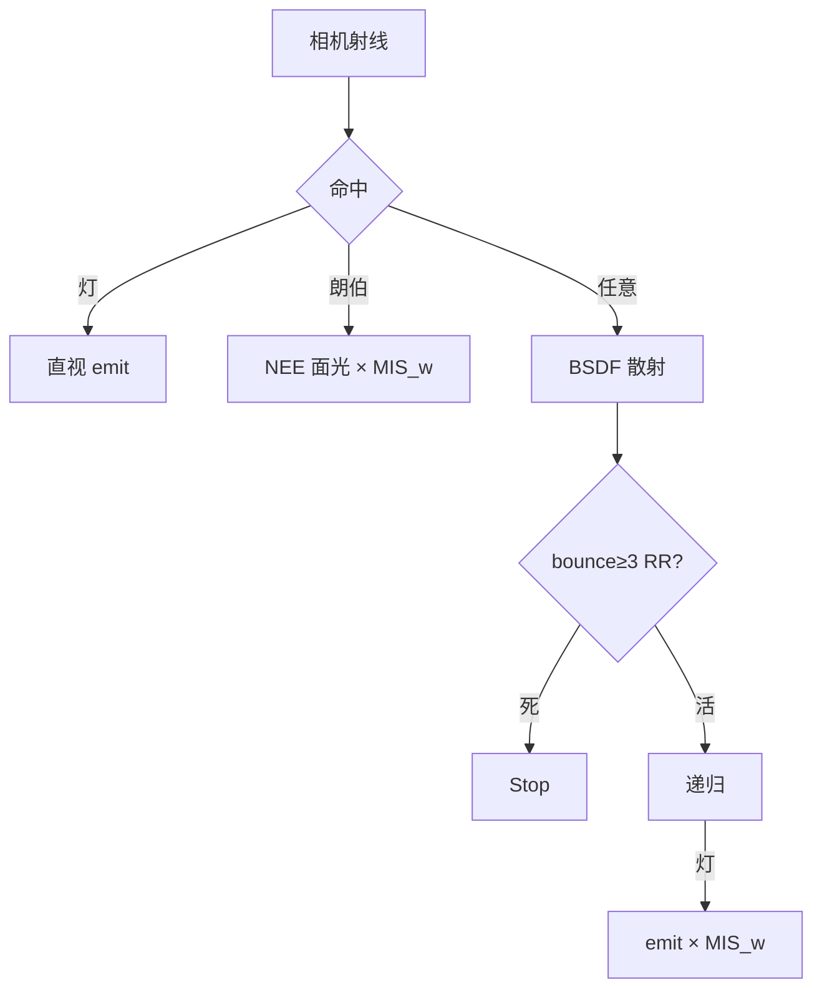

# 架构深潜

## 采样栈

## MIS

\[
w(p,q)=\frac{p^2}{p^2+q^2}
\]

- 灯策略贡献 × \(w(\mathrm{pdf}_L,\mathrm{pdf}_f)\)
- BSDF 撞灯 × \(w(\mathrm{pdf}_f,\mathrm{pdf}_L)\)

## 俄罗斯轮盘

bounce ≥ 3：\(p=\mathrm{clamp}(\max(\rho),0.05,0.95)\)；死亡则停，存活则 \(\rho/=p\)。

## SAH-BVH

代价：\(C = C_\mathrm{trav} + (A_L N_L + A_R N_R)/A_\mathrm{parent}\)

12 桶扫描三轴，取最小代价划分。

## 开关

| 标志 | 作用 |
|------|------|
| BVH | SAH 树 / 暴力列表 |
| NEE | 面光直接采样 |
| MIS | 平衡启发 |
| RR | 路径截断 |
