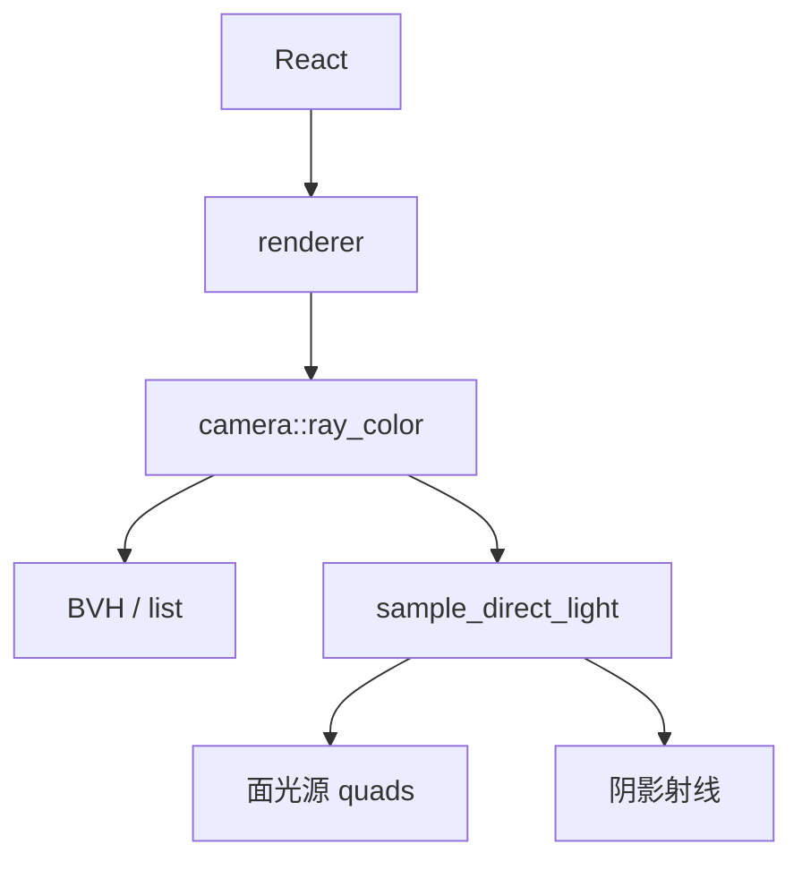
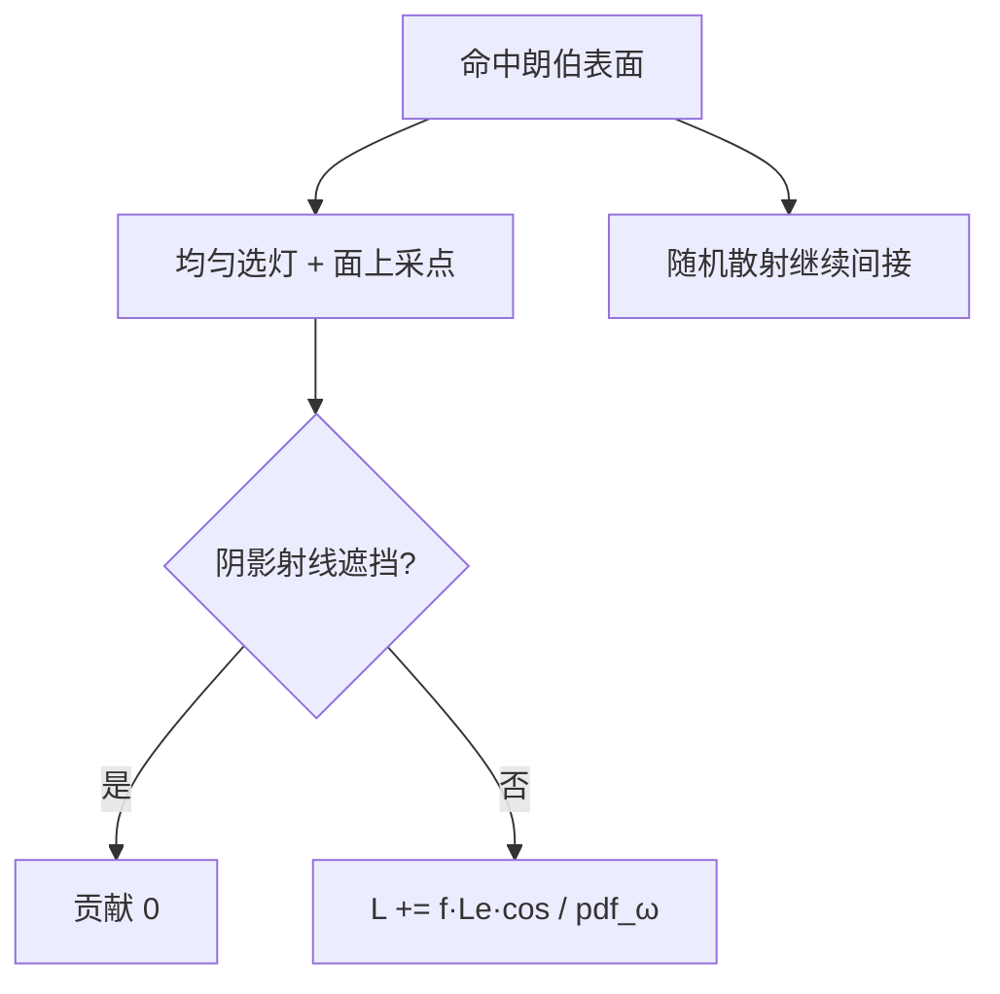

# 架构深潜（简体中文）

## 1. 渲染链路

## 2. NEE（下一事件估计）

防双重计数：

- 相机射线直接看到灯 → 返回 `emitted`
- 间接路径撞灯 → `emitted = 0`（直接光已由 NEE 计入）

公式（朗伯）：

\[
L_{\text{direct}} = \frac{\rho}{\pi}\, L_e\, \frac{\cos\theta_s}{\mathrm{pdf}_\omega},\quad
\mathrm{pdf}_\omega = \frac{1}{N\cdot A}\cdot\frac{r^2}{\cos\theta_L}
\]

## 3. BVH

盒子剪枝：miss AABB → 整棵子树跳过。场景 4 多球可开关对比。

## 4. 场景 id

| id | 内容 |
|----|------|
| 0–2 | 户外/金属教学 |
| 3 | 康奈尔箱 + 面光（NEE 主战场） |
| 4 | 多球 BVH 测试 |

## 5. 源码索引

| 文件 | 职责 |
|------|------|
| `camera.h` | 路径追踪 + NEE |
| `quad.h` | 面采样 / 面积 |
| `bvh.h` | 加速结构 |
| `scenes.h` | 场景与 lights 列表 |
