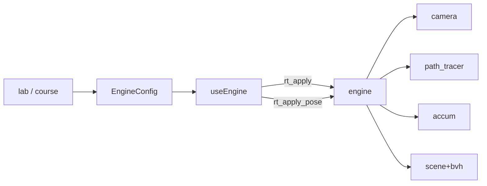

# 架构（三刀完成后）

## 一句话

**前端一份 `EngineConfig` → `rt_apply` / `rt_apply_pose` → C++ `engine`。**

## 前端

| 路径 | 职责 |
|------|------|
| `engine/types.ts` | Config 唯一源 |
| `engine/applyConfig.ts` | Config → WASM 参数 |
| `engine/useEngine.ts` | 生命周期 + rAF |
| `engine/wasm.ts` | 只认 apply / applyPose |
| `lab/*` | 实验台 UI |
| `App.tsx` | 壳 |

## C++

| 文件 | 职责 |
|------|------|
| `config.h` | POD 配置 |
| `camera.h` | 射线 |
| `path_tracer.h` | 积分 |
| `engine.h` | 编排 |
| `wasm_bridge.cpp` | `rt_apply` 主入口 |

详见 [`cpp/README.md`](../cpp/README.md)。

## 同步策略

| 变化 | 调用 |
|------|------|
| 场景 / 分辨率 / 开关 / 深度 / 调试 / 背景 | `rt_apply` |
| 仅轨道 / FOV / 光圈 | `rt_apply_pose` |
