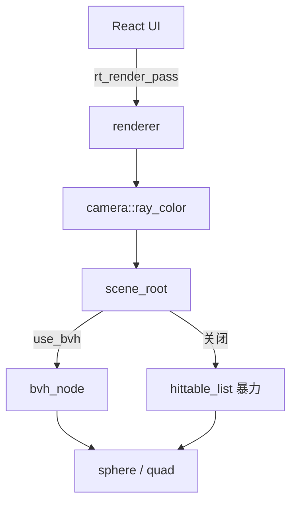
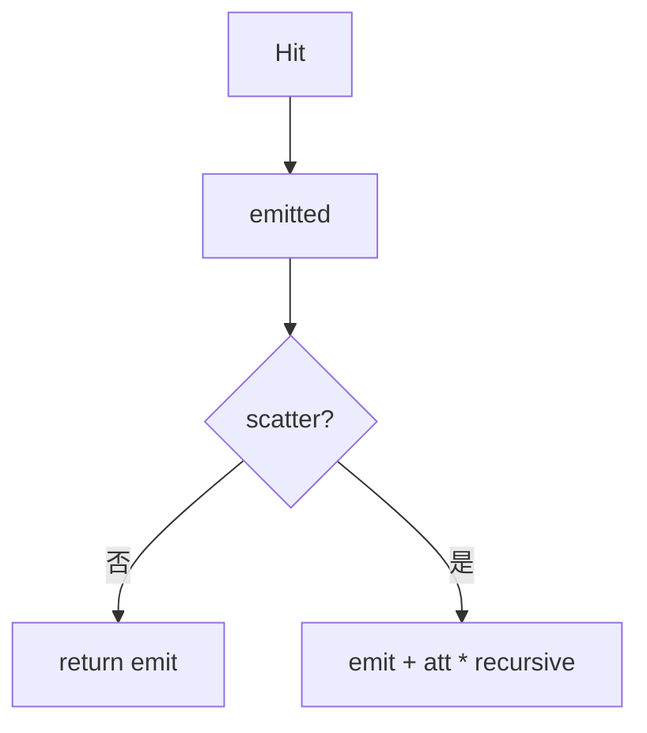
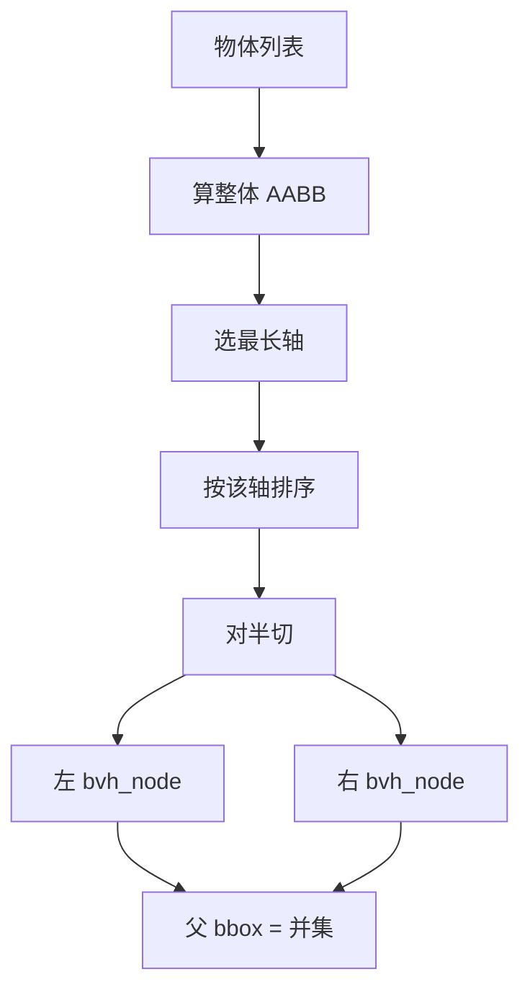
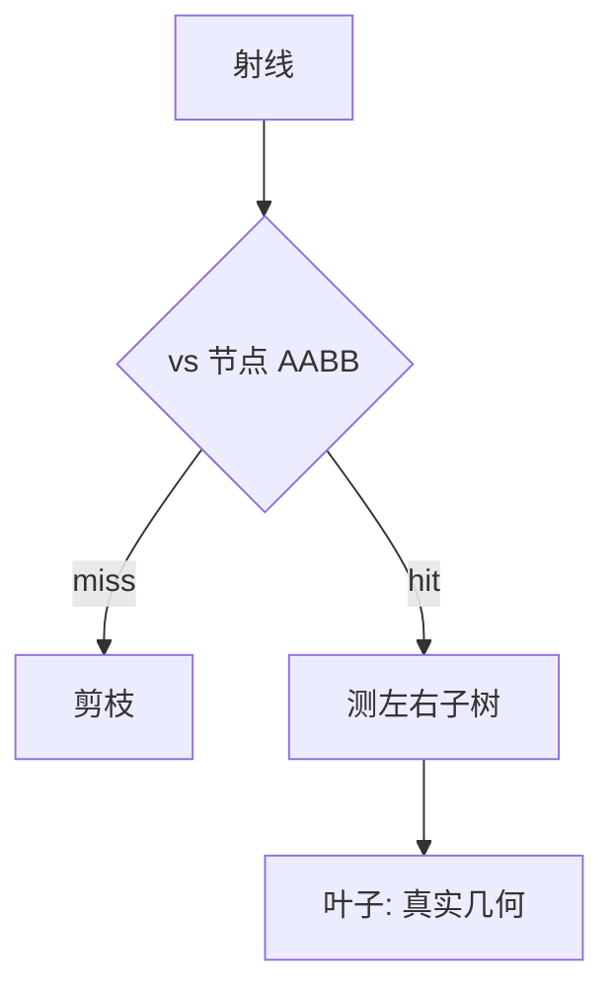

# 架构深潜（简体中文）

本文用 Mermaid 把 **cpp-002** 的每条数据路径画清楚。

---

## 1. 渲染链路

---

## 2. 含自发光的着色

---

## 3. BVH

### 构建

### 查询

复杂度直觉：暴力 \(O(n)\) 次物体测试；平衡 BVH 约 \(O(\log n)\)。

源码：`aabb.h`、`bvh.h`、`renderer.h`（`use_bvh`）。

---

## 4. 场景

| id | 内容 |
|----|------|
| 0 | 经典三球 |
| 1 | 玻璃气泡 |
| 2 | 金属走廊 |
| 3 | 康奈尔箱 + 面光 |
| 4 | 随机多球（BVH 测试） |

---

## 5. WASM API（节选）

| 符号 | 作用 |
|------|------|
| `rt_set_use_bvh` | 开关 BVH |
| `rt_primitive_count` | 图元数量 |
| `rt_set_debug_mode` | 0..3 调试 |
| `rt_set_scene` | 0..4 场景 |

---

## 6. 下一步

- 面光重要性采样（降噪）
- SAH 划分 BVH（更快构建质量）
- 三角 mesh
