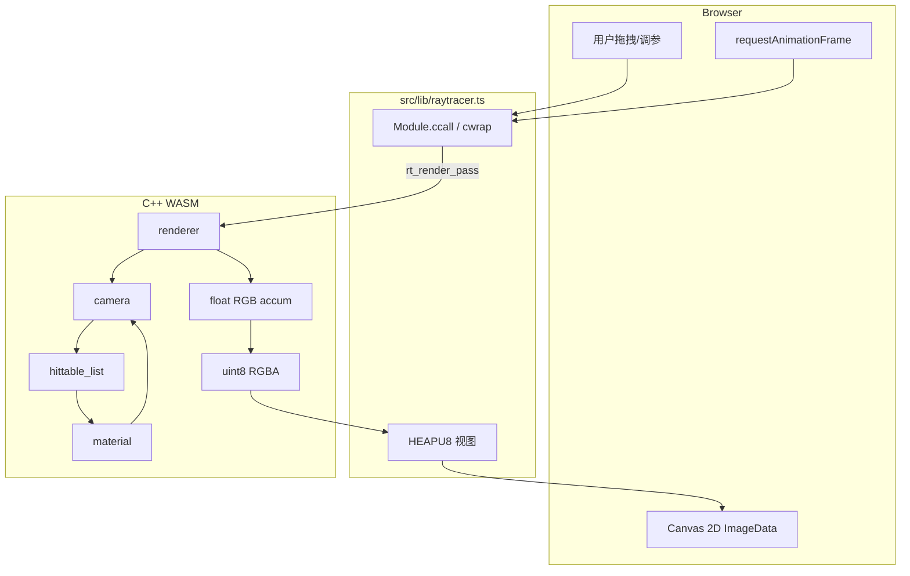
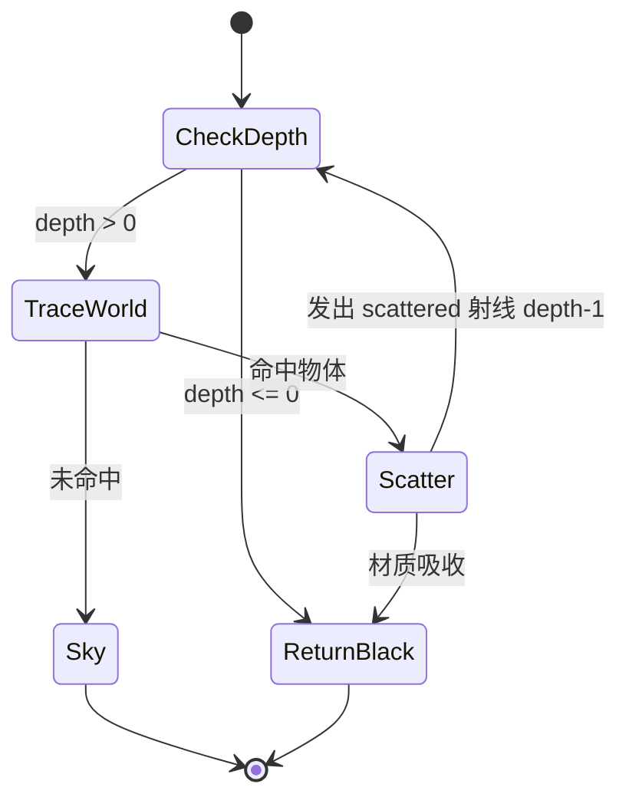
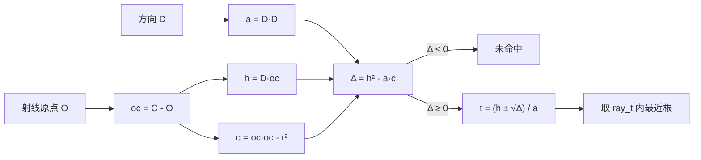
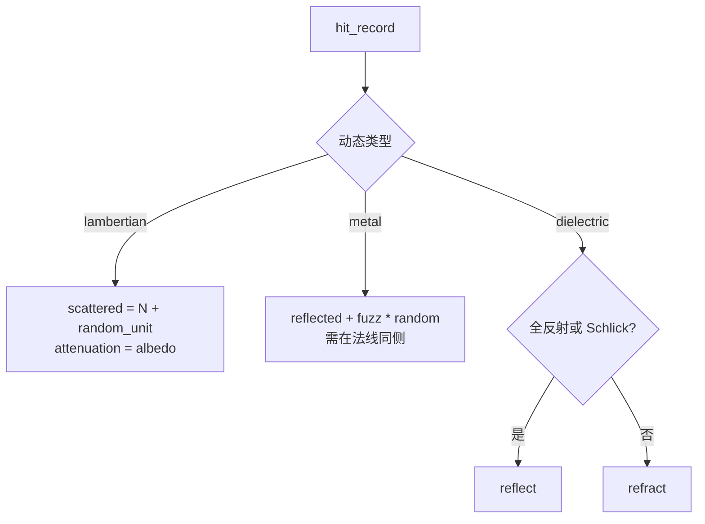
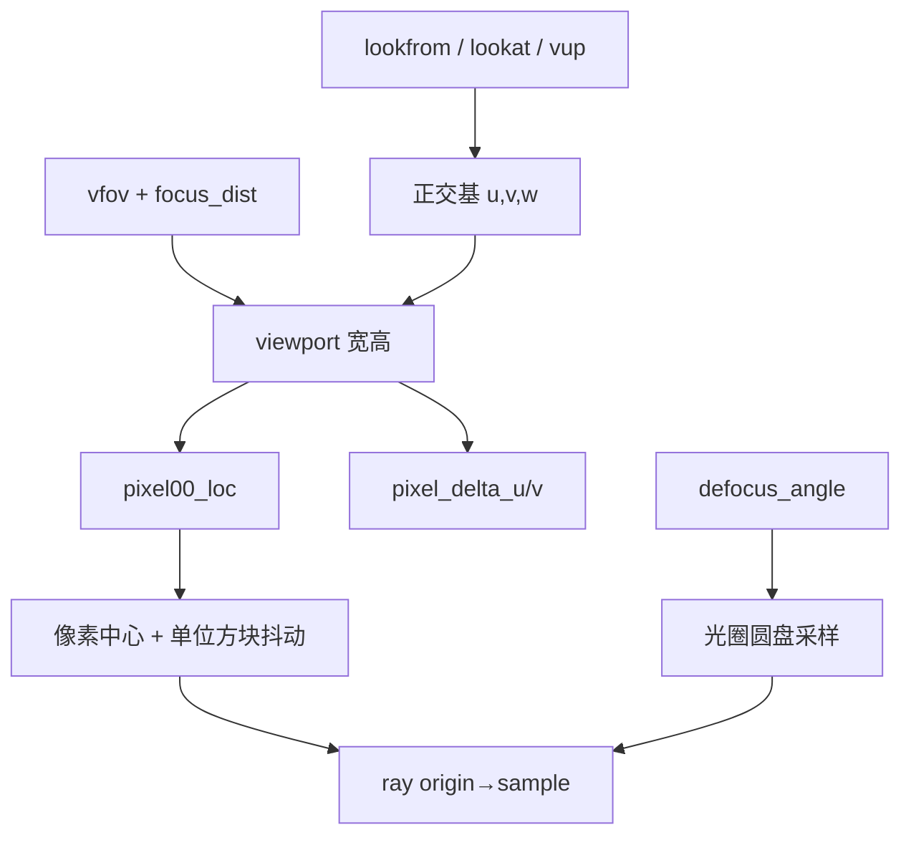
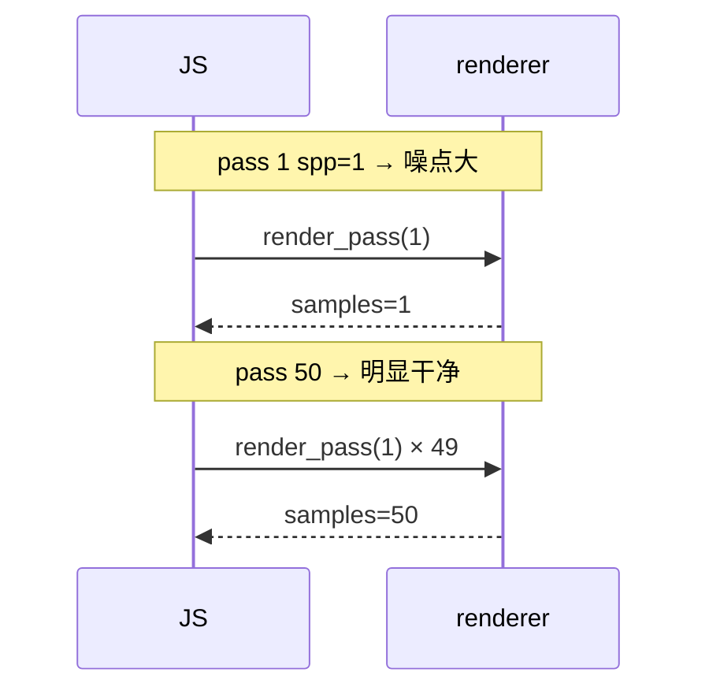

# 架构深潜（简体中文）

本文用 Mermaid 把 **cpp-002** 的每条数据路径画清楚，方便对照 `cpp/` 源码阅读。

---

## 1. 从 UI 到像素的完整链路

---

## 2. `ray_color` 状态机

对应代码：`cpp/camera.h` → `camera::ray_color`。

---

## 3. 球求交几何

对应代码：`cpp/sphere.h`。

---

## 4. 材质分支

对应代码：`cpp/material.h`。

---

## 5. 相机成像平面

对应代码：`cpp/camera.h` → `initialize` / `get_ray`。

---

## 6. 渐进累加

设像素颜色估计为随机变量 \(X_i\)，则：

\[
\hat{L}_N = \frac{1}{N}\sum_{i=1}^{N} X_i
\]

实现上我们在 `accum` 里存 \(\sum X_i\)，显示时除以 `samples_done`。  
每调用一次 `render_pass(spp)`，\(N \mathrel{+}= spp\)。

---

## 7. WASM 导出表

| C 符号 | 作用 |
| --- | --- |
| `rt_init(w,h,scene)` | 分配缓冲、建场景、重置相机 |
| `rt_set_camera(...)` | 更新相机并清空累加 |
| `rt_set_scene(id)` | 切换场景 |
| `rt_set_max_depth(d)` | 最大反弹 |
| `rt_render_pass(spp)` | 再采样 spp 次 |
| `rt_rgba_ptr` | RGBA8 指针（HEAP 偏移） |
| `rt_samples` | 当前累计样本数 |

---

## 8. 下一步可以做什么

- BVH 加速大量球体
- 纹理 / 棋盘地面
- 四边形光源与重要性采样
- OpenMP / SIMD 或 WebWorker 多实例并行

每加一块，建议先画一张 Mermaid，再写对应 C++ 头文件。
