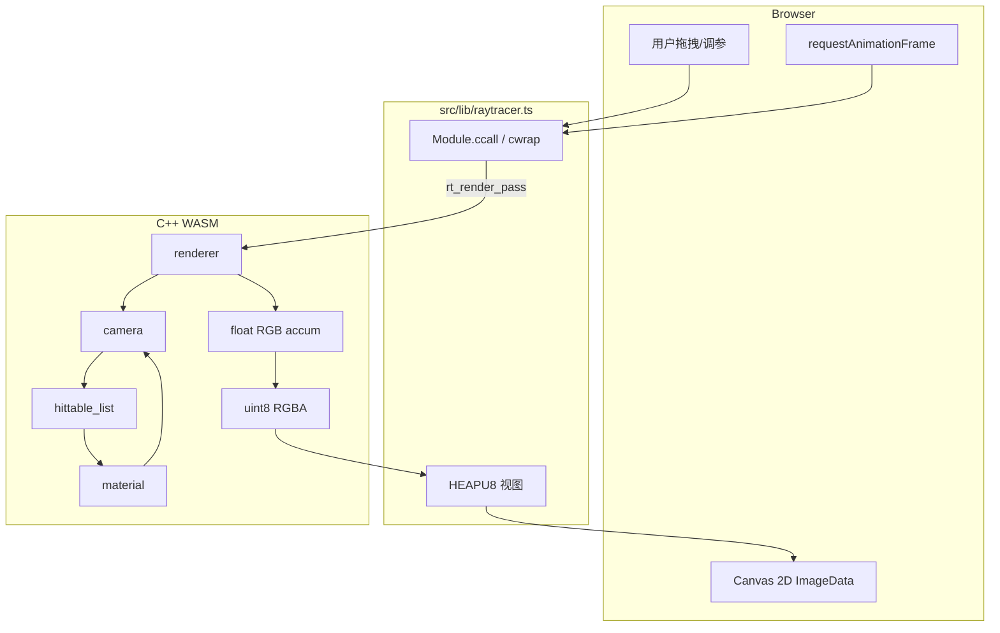
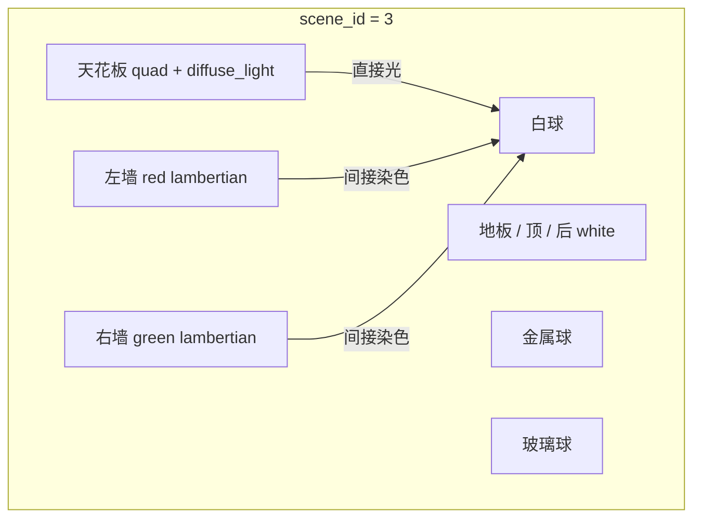
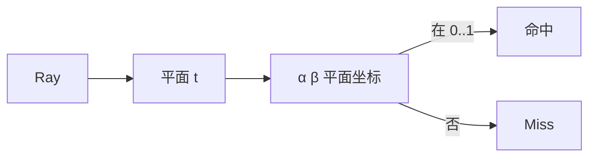

# 架构深潜（简体中文）

本文用 Mermaid 把 **cpp-002** 的每条数据路径画清楚，方便对照 `cpp/` 源码阅读。

---

## 1. 从 UI 到像素的完整链路



---

## 2. 含自发光的 `ray_color`

```mermaid
flowchart TB
  Start[ray_color] --> Depth{depth > 0?}
  Depth -->|否| Black[黑色]
  Depth -->|是| Hit{命中?}
  Hit -->|否| BG[background<br/>康奈尔箱=黑]
  Hit -->|是| Debug{debug_mode}
  Debug -->|1 法线| N[0.5*(n+1)]
  Debug -->|2 深度| Dep[t 映射灰度]
  Debug -->|3 发光| E0[emitted only]
  Debug -->|0 美观| Emit[emit = mat.emitted]
  Emit --> Sc{scatter?}
  Sc -->|否| OnlyE[return emit]
  Sc -->|是| Rec[emit + att * ray_color]
```

对应：`cpp/camera.h`、`cpp/material.h`（`diffuse_light`）。

关键式：

\[
L = L_e + f_r \cdot L_i
\]

教学实现里 \(L_e =\) `emitted`，\(f_r \cdot L_i \approx\) `attenuation * ray_color(scattered)`。

---

## 3. 康奈尔箱几何



- 墙与灯：`cpp/quad.h` 平行四边形  
- 组装：`cpp/scenes.h`  

---

## 4. 球与四边形求交

**球**：二次方程（`sphere.h`）  

**四边形**：射线与平面求 \(t\)，再投影到 \((\alpha,\beta)\in[0,1]^2\)（`quad.h`）



---

## 5. 渐进累加

\[
\hat{L}_N = \frac{1}{N}\sum_{i=1}^{N} X_i
\]

`render_pass(spp)` 使 \(N \mathrel{+}= spp\)。面光源场景噪点更大，需要更多 spp 才能看清间接染色。

---

## 6. WASM 导出表

| C 符号 | 作用 |
| --- | --- |
| `rt_init(w,h,scene)` | 分配缓冲、建场景 |
| `rt_set_camera(...)` | 更新相机并清空累加 |
| `rt_set_scene(id)` | 切换场景 0..3 |
| `rt_set_debug_mode(m)` | 0 美观 / 1 法线 / 2 深度 / 3 发光 |
| `rt_set_max_depth(d)` | 最大反弹 |
| `rt_render_pass(spp)` | 再采样 |
| `rt_rgba_ptr` | RGBA8 指针 |

---

## 7. 下一步

- BVH 加速大量物体  
- 重要性采样面光源（降噪）  
- 四边形盒子（Cornell 经典方柱）  

每加一块，先画 Mermaid，再写 C++。
