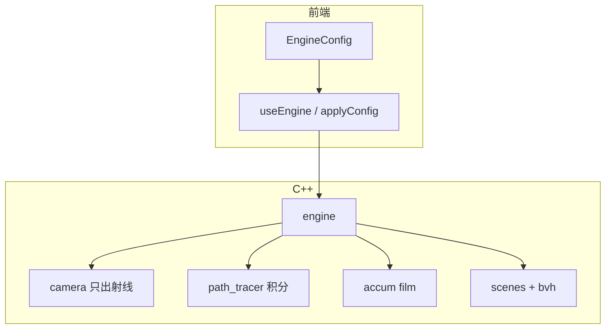

# 架构

## 两层收口后

## C++ 职责

| 模块 | 职责 |
|------|------|
| `config.h` | EngineConfig / CameraPose / TraceFlags |
| `camera.h` | get_ray only |
| `path_tracer.h` | 渲染方程 · NEE · MIS · RR · debug |
| `engine.h` | 编排 + film + 兼容旧 setter |
| `scenes.h` | 几何与 lights |
| `wasm_bridge.cpp` | C API → engine |

## 前端

| 模块 | 职责 |
|------|------|
| `engine/types.ts` | 唯一 Config |
| `engine/useEngine.ts` | 投影 + rAF |
| `lab/*` | UI |
| `App.tsx` | 壳 |

## 同步

- 重建：scene / res / flags / depth / debug → `applyConfig`
- 相机：orbit / fov / defocus → `applyCameraOnly` → `engine.set_pose`
