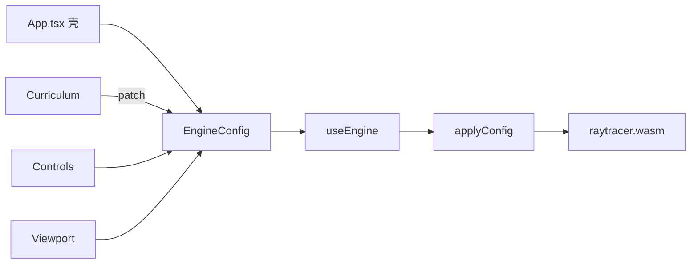

# 架构（第一刀后）

## 原则

1. **前端只持有一份 `EngineConfig`**
2. **`useEngine` 是唯一把 Config 投影到 C++ 的地方**
3. **课程只返回 `ConfigPatch`，不碰 WASM**
4. **C++ 算法层暂不动**（第二刀再拆 camera/integrator）



## 目录

```text
src/
  engine/     types · wasm · applyConfig · useEngine
  lab/        Viewport · Controls · ui
  components/ Curriculum · Mermaid · LearningPanel
  curriculum/ 课程数据
  App.tsx     ≤150 行布局
cpp/          渲染内核（下一刀拆 integrator）
```

## 同步策略

- 场景 / 分辨率 / 开关 / 深度 / 调试 → `applyConfig`（重建）
- 仅轨道 / FOV / 光圈 → `applyCameraOnly`（不清场景）
