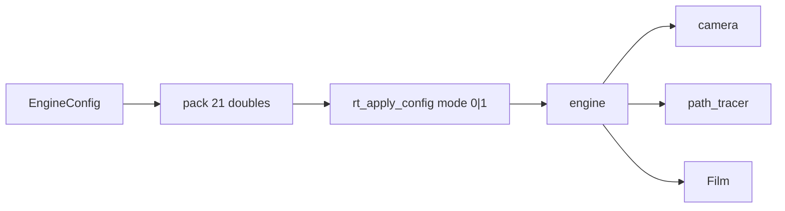

# 架构

## 分层

```text
src/
  engine/   types · pack · wasm · applyConfig · useEngine
  lab/      Viewport · Controls
  App.tsx   壳

cpp/
  config.h camera.h path_tracer.h engine.h   # 核心 API
  math/     vec3 ray interval aabb onb color
  geo/      hittable sphere quad bvh
  mat/      material
  scene/    scenes
  api/      wasm_bridge · main_cli
```



## 配置打包（前后端同布局）

| 下标 | 含义 |
|------|------|
| 0–2 | width height scene |
| 3–8 | depth debug bvh nee mis rr |
| 9–14 | lookfrom lookat |
| 15–17 | vfov defocus focus |
| 18–20 | background rgb |

- `mode=0`：完整 `engine.set`
- `mode=1`：仅姿态（拖拽）

## 原则

1. 前端只持有 `EngineConfig`
2. 一次 `applyConfigPacked` 投影到 C++
3. camera ≠ integrator
4. 旧 `rt_set_*` 仍导出，主路径不再使用
